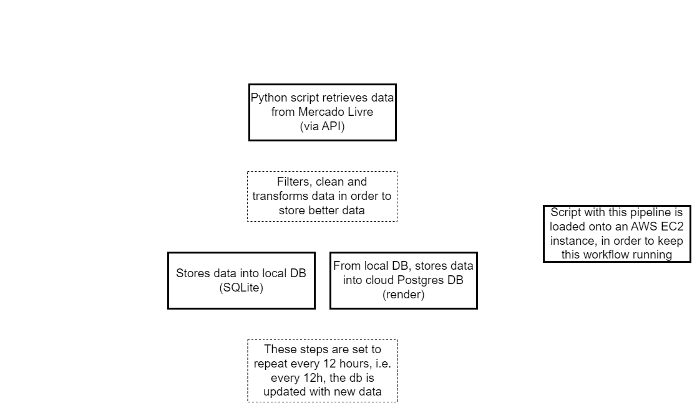

# ETL Mercado Livre's API  

## Project Description
The main goal of this project is to gather, clean, 
organize and store data from a category of products in Mercado Livre,
a giant marketplace which opperates mainly in Latin America. 
The data retrieved is intended to be used in future data projects such as ML projects.

> For this project the main technologies used were python 3.12.4, SQLite, Cloud PostgresDB and AWS EC2.

## Project Detailed Explanation (Visual Flow Img at the Bottom)

### First part
Mercado Livre has an API intended for many purposes, one of those is gather data from Mercado Livre marketplace.
For that, it was used `requests` lib, and with the returning object from `requests.get()` a ***json*** object was retrieved.
This json has data from all the request items. 

However, the API limits the number of item per request (using "limit" parameter) where the default and max value are 50 items.
Also, another parameter called "offset" is used to drift from those first 50 items. 
e.g. if we set limit=30 and offset=50, it means that the request will return the 30 item after the first 50 items.
Also the offset parameter has default value  of 0 and max value of 1000, so it was possible to get only the first 1050 items of that category.

### Second part
After the data was gathered, it was cleaned, manipulated/transformed (when needed) and organized into a dict and for a following dataframe creation with `pandas`.
From this df, a SQLite table was created into a local *temp.db* file, and from this local DB the table was uploaded into a PostgresDB in [Render](render.com).

The step of first using a local DB was necessary because Render free database has an expiration time of 1 month, so, in order to make it easier to reupload the data
after the DB expiration and preserve the data in the previous DB, this local DB is useful, since it has no expiration date.

### Third part
At this point, a cloud DB is available for data access. But the automation for data update isn't configured yet. 
For that, the script was built in a loop which runs every 12 hours, hence every 12h fresh data is appended to the DB.

In order to make this script always online, a Dockerfile was built and a AWS EC2 Linux instance was created, 
so at the end the docker image was uploaded into the EC2 then the scripts started to run there.

